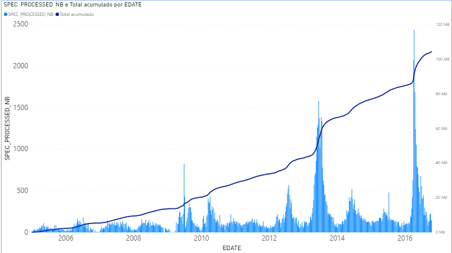
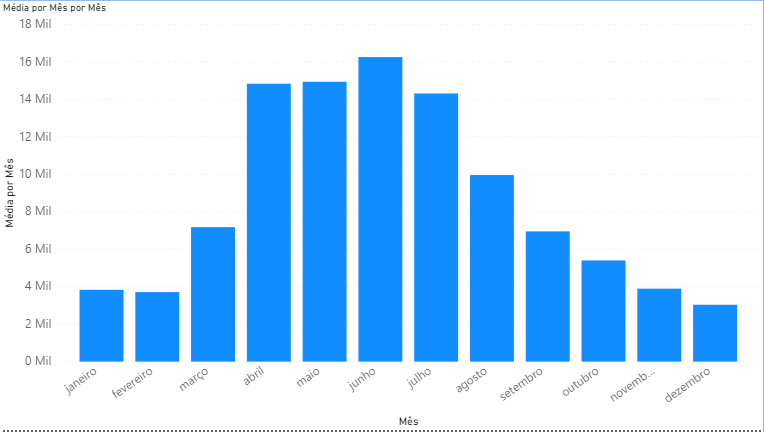

## Aula Prática - Power BI - IGTI Bootcamp Analista de Dados

- Esta prática será para que possamos ver na prática alguns conceitos visto nas aulas teóricas, não é uma aula sobre Power BI. 
- Aqui segue a [fonte](./Apoio/influenza_weekly.csv) de Dados sobre o H1N1. 
- Vamos responder algumas perguntas:
  * Qual a velocidade em que os casos aumentaram no Brasil?
    - Podemos ver que a taxa de crescimento de ddados permaneceu quase constante e que houve um aumento mais acentuado dessa taxa nos anos de 2013 e 2016.

  

  * Por ser uma doença respitratória, os meses ou estações influenciam no crescimento do número de casos?
    - Com o gráfico podemos inferir que as estações podem ser um fator de causalidade no crescimento de casos.

  

